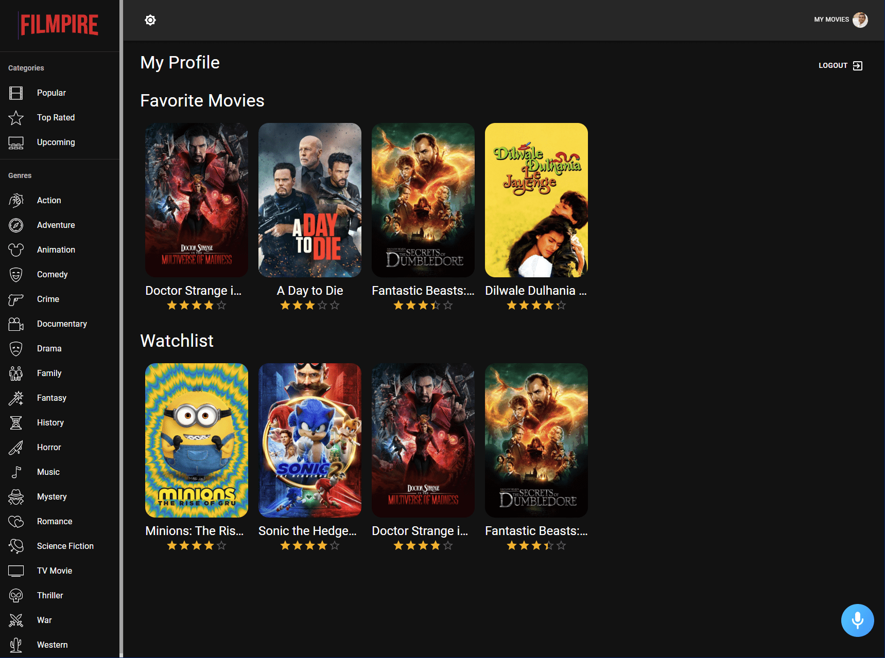
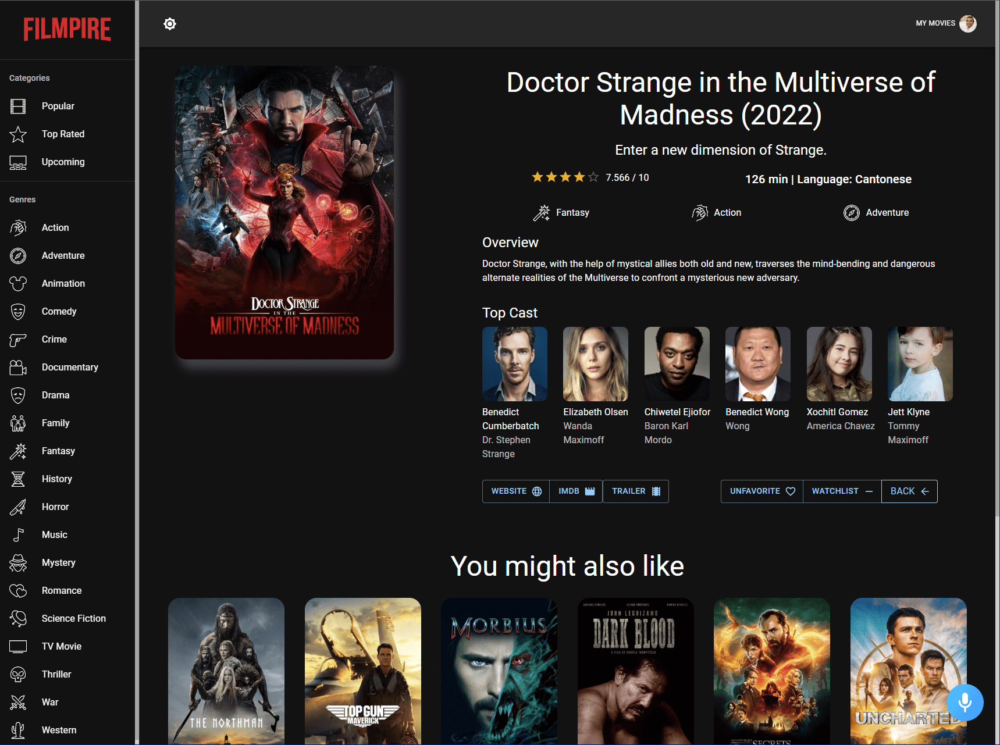
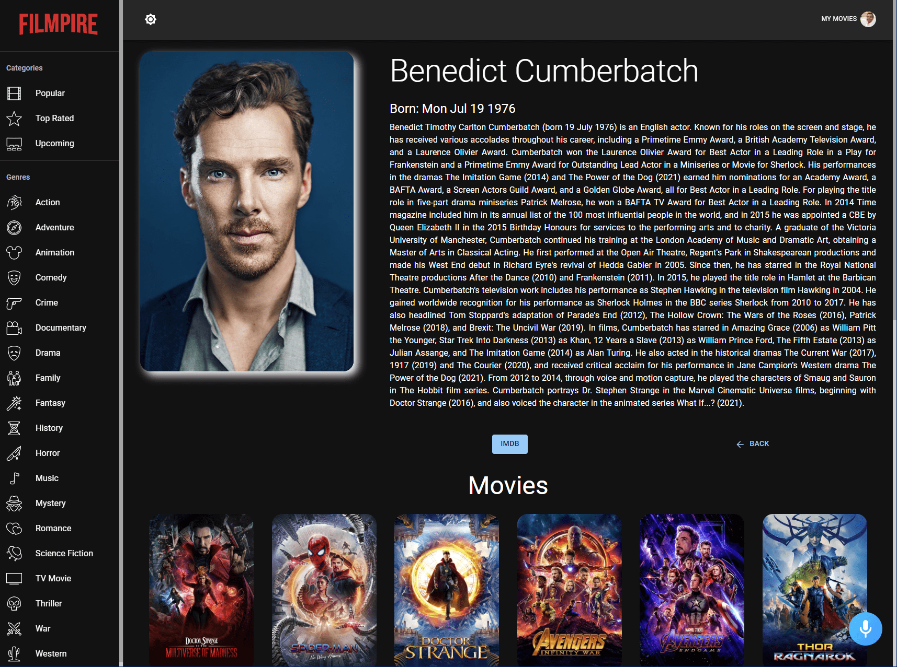

Filmpire
========

Filmpire application is created using ReactJS, Redux, Material UI and Alan AI.  
Filmpire is an application where you can find the movies you love.  
You can check the top rated, popular and upcoming movies or search for a specific movie or filter movies by genre.  
You can interact with the application using Alan AI voice assistant and switch between `light` and `dark` themes.  

  

  

You can mark movies as favourite and add them to your watchlist. Your favourite and watchlisted movies list can be viewed on your profile page.  

You can take a look at a specific movie's  details, watch its trailer, cast and similar movies.   

  

  

You can also take a look at a specific cast details and their movies.  

  
