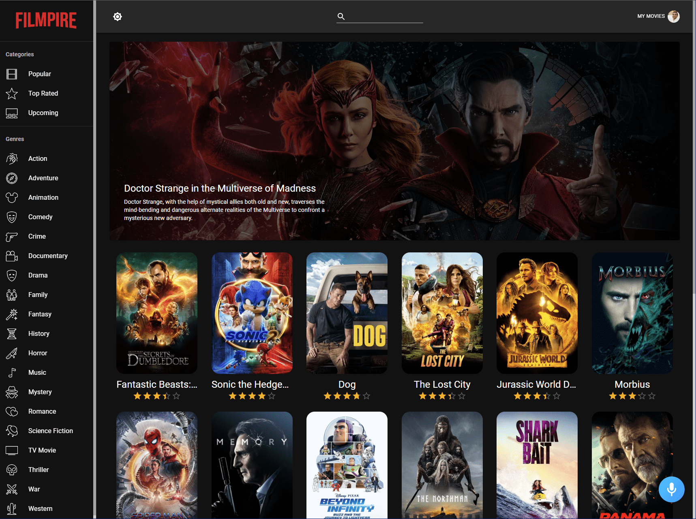
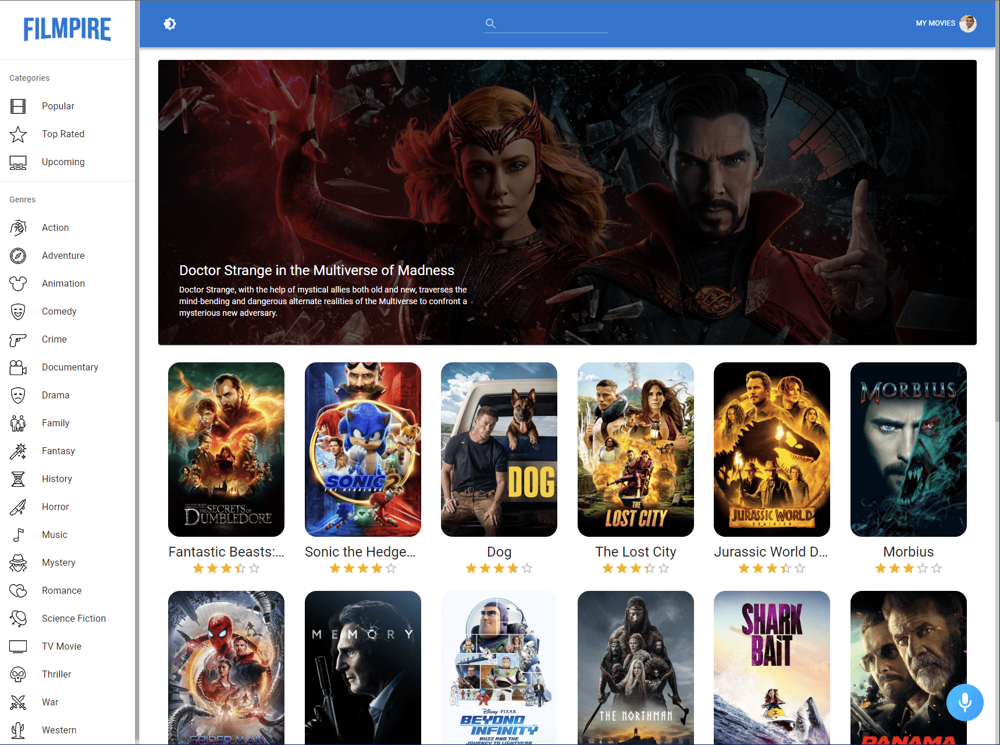
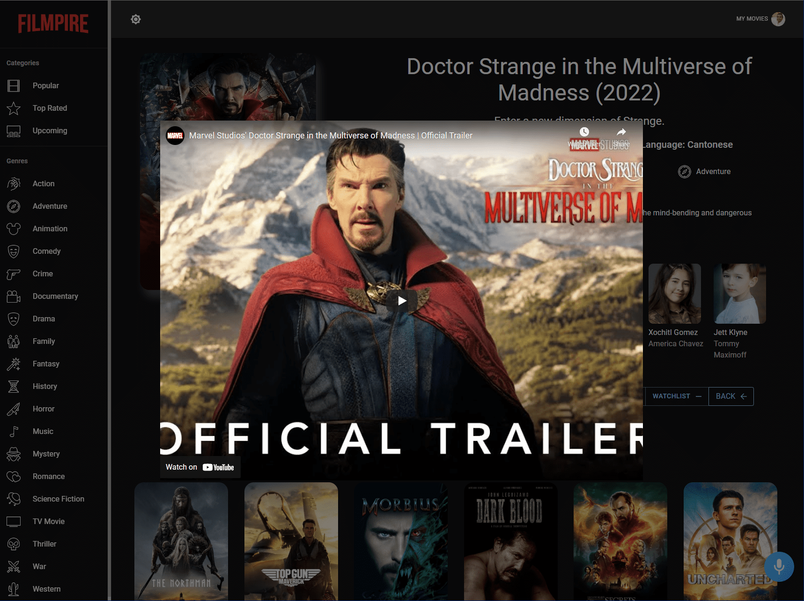

Filmpire
========

[Live Application](https://utkarsh-filmpire.netlify.app/)  

The Filmpire application is built using ReactJS, Redux, Material UI, and Alan AI. It serves as a platform for discovering movies tailored to your preferences. Users can explore top-rated, popular, and upcoming movies, as well as search for specific films or filter them by genre. The application integrates with Alan AI's voice assistant for interactive functionality and supports both `light` and `dark` themes. Users can personalize their experience by marking movies as favorites and adding them to their watchlist. These customized lists are accessible on the user's profile page. Detailed information about movies, including trailers, cast, and similar films, can be accessed as well.  

  

   

  

   

  
